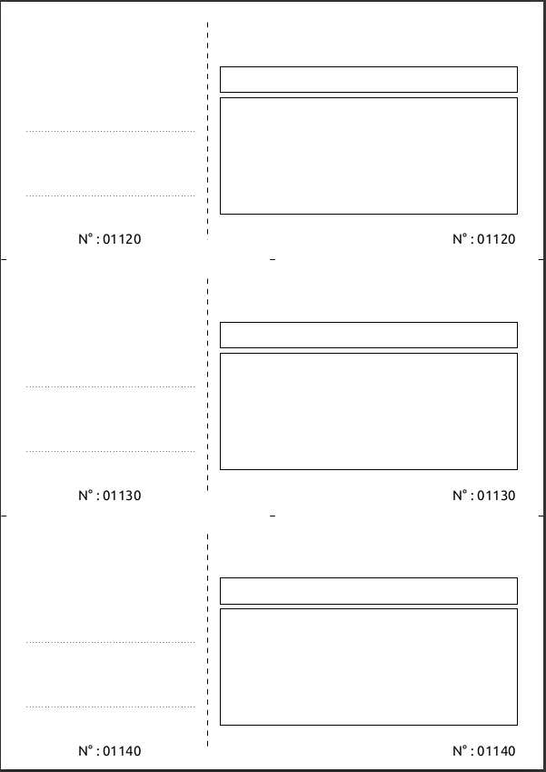
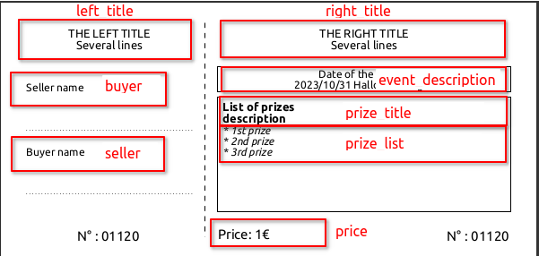

# Rafle book generator

# Other languages
* [French version](docs/doc-fr.md)

# Purpose
Easily generate customizable raffle books using a CLI.
* 3 tickets per page
* 10 tickets per book
# How to use it?
## Command
### Choose the correct binary depending on your OS
* Windows: `bin/generate-raffle-book-amd64-windows`
* Linux: `bin/generate-raffle-book-amd64-linux`
* MacOS: `bin/generate-raffle-book-amd64-darwin`

### PDF file
The generated file is located in `build/tickets.json` path

### Standard (adapt to your OS)
```bash
bin/generate-raffle-book-amd64-windows
```
Generates 12 books aka. 120 tickets

### Extra params for custom numbering
```bash
bin/generate-raffle-book-amd64-windows -start=120 -count=100
```
Gerenates 100 books, starting at 120.

The start and count are rounded to upper closest (starts at 121, creates 102 books) numbers to keep the numbering continuous

## How-to customize ?
## What you cannot customize

All the texts are customizable except the numbers (N° 0XXXX)


## What you can customize


## How you can do it
copy `assets/customs.json.dist` to `assets.customs.json`
```bash
make customs
```

Now, edit the `assets/customs.json` to fit your need. 

### Example 1: update the texts items 

__Respect the json format (use [this tool](https://jsonformatter.curiousconcept.com/) for instance)__

```json
{
    "left_title": [
        "HIGH SCHOOL",
        "LONDON & FRIENDS"
    ],
    "right_title": [
        "LONDON & FRIENDS HIGH SCHOOL",
        "LOTTERY SUBSCRIPTION"
    ],
    "event_description": [
        "Date of the lottery",
        "2023/10/31 Halloween night - The Graveyard"
    ],
    "prize_title": [
        "List of prizes"
    ],
    "prize_list": [
        "* 1st prize",
        "* 2nd prize",
        "* 3rd prize"
    ],
    "price": "Price: £1",
    "buyer": "Buyer name",
    "seller": "Seller name"
}
```